# CHAPTER 3: METHODOLOGY

---

## 3.1 Introduction

This chapter presents the systematic methodology employed in designing, developing, and validating an MQTT network security scanner for Internet of Things (IoT) environments. The research addressed the identified gap in lightweight, protocol-aware security assessment tools capable of detecting common MQTT misconfigurations including anonymous broker access, absence of Transport Layer Security (TLS) encryption, inadequate authentication enforcement, and unrestricted topic subscriptions.

The methodology encompassed five principal components: evaluation and selection of an appropriate software development model suited to academic constraints and evolving requirements, structured development activities across two academic semesters (FYP1 and FYP2), comprehensive system design incorporating architectural and behavioral modeling, specification of hardware and software requirements with budget considerations, and project planning with risk management strategies. The adopted approach facilitated iterative refinement while maintaining rigorous documentation standards expected in academic research.

This chapter demonstrates how the research objectives articulated in Chapter 1 were systematically operationalized into concrete development activities, ultimately yielding a functional three-tier web-based scanning platform comprising a Laravel dashboard for user interaction, a Flask RESTful API for orchestration, and a Python-based MQTT scanner engine for protocol-level assessment. The methodological framework presented herein directly informs the implementation details documented in Chapter 4 and the empirical testing outcomes presented in Chapter 5.

---

## 3.2 Software Development Model Evaluation

Prior to commencing development activities, five established software development models were evaluated against project-specific criteria including academic timeline constraints (28 weeks across two semesters), requirement volatility expectations, resource availability, and the need for iterative refinement based on testing feedback. The evaluation process considered the Waterfall model, Agile methodology, Spiral model, V-Model, and Prototype model, assessing each against suitability for IoT security tool development in an academic research context.

### 3.2.1 Model Descriptions and Comparative Analysis

**Waterfall Model:**
The Waterfall model prescribes linear sequential progression through distinct phases—requirements analysis, system design, implementation, testing, deployment, and maintenance—with minimal provision for revisiting completed phases. While its structured nature provides clear milestone definitions suitable for projects with stable, well-understood requirements, the model's rigidity proved incompatible with this research project's exploratory nature. The inability to accommodate mid-development requirement modifications based on supervisor feedback or testing discoveries rendered the Waterfall approach unsuitable.

**Agile Methodology:**
Agile advocates iterative and incremental development through short, timeboxed development cycles, emphasizing adaptive planning, continuous stakeholder collaboration, and regular delivery of functional increments. The methodology's inherent flexibility enables accommodation of evolving requirements and incorporation of lessons learned across iterations. Agile's emphasis on working software over comprehensive documentation aligned well with the project's objectives of delivering a functional prototype within academic constraints.

**Spiral Model:**
The Spiral model integrates iterative development with explicit risk management, requiring formal risk analysis during each iteration cycle. While valuable for large-scale, high-risk commercial projects, the overhead associated with formal risk documentation and analysis activities was deemed excessive for a two-semester academic project where time resources were constrained and formal risk management processes would consume development capacity without commensurate benefit.

**V-Model (Verification and Validation):**
The V-Model extends Waterfall principles by mandating parallel development and testing activities, where each development phase has a corresponding validation phase. The model's emphasis on rigorous testing procedures suits projects requiring high reliability certification. However, its predetermined test specification approach conflicted with this project's research orientation, where testing outcomes informed design decisions rather than validating pre-existing specifications.

**Prototype Model:**
The Prototype model advocates building initial working prototypes to clarify requirements through stakeholder feedback before committing to full-scale development. While prototyping activities were incorporated during FYP1 to validate core scanning concepts, a pure Prototype model approach lacked the structural framework necessary for FYP2's production-grade implementation encompassing web dashboard integration, database persistence, and hardware testbed configuration.

**Table 3.1: Software Development Model Comparison Matrix**

| Model     | Flexibility                   | Documentation                           | Testing                           | Suitability        | Selection Rationale                                                                          |
| --------- | ----------------------------- | --------------------------------------- | --------------------------------- | ------------------ | -------------------------------------------------------------------------------------------- |
| Waterfall | Low - sequential phases       | Heavy - formal at each stage            | Late - after implementation       | Unsuitable         | Inability to accommodate requirement evolution discovered during FYP1 testing                |
| Agile     | High - iterative cycles       | Moderate - working software prioritized | Continuous - throughout lifecycle | **Selected**       | Flexibility for requirement adaptation, iterative refinement, continuous testing integration |
| Spiral    | High - risk-driven iterations | Heavy - extensive risk documentation    | Iterative - after each cycle      | Unsuitable         | Excessive overhead for 28-week academic timeline; formal risk analysis impractical           |
| V-Model   | Low - predetermined testing   | Heavy - parallel documentation          | Structured - phase-specific       | Unsuitable         | Predetermined test approach conflicted with exploratory research methodology                 |
| Prototype | Moderate - prototype-focused  | Light - minimal                         | Prototype validation only         | Partially suitable | Useful for FYP1 validation but insufficient structural framework for FYP2 expansion          |

---

## 3.3 Selected Development Model and Justification

### 3.3.1 Model Selection: Agile Methodology

After careful evaluation of the available software development models, **Agile Methodology** was selected as the most appropriate approach for developing the MQTT Network Scanning Tool. This decision was based on comprehensive analysis of project requirements, academic constraints, and the need for adaptive development.

### 3.3.2 Justification for Selecting Agile

The selection of Agile methodology over alternative models is justified by the following compelling reasons:

**1. Evolving Requirements:**
Initial project requirements focused on CLI-based MQTT scanning. As development progressed through FYP1 to FYP2, new requirements emerged including web dashboard integration, real-time sensor data visualization, database storage, and advanced authentication mechanisms. Agile's flexibility accommodated these evolving requirements without requiring complete project restructuring.

**2. Iterative Development Benefits:**
The transition from FYP1 (CLI prototype) to FYP2 (web-based system with hardware integration) required incremental development where each iteration built upon previous work while incorporating lessons learned. Agile's sprint-based approach enabled systematic progression through distinct development phases:

- FYP1: Core scanning engine and CSV reporting
- FYP2 Phase 1: Web interface development (Flask API + Laravel dashboard)
- FYP2 Phase 2: Hardware integration (Docker brokers + ESP32 publishers)
- FYP2 Phase 3: Security hardening and comprehensive testing

**3. Continuous Testing and Feedback:**
Agile's emphasis on testing throughout the development cycle was crucial for validating MQTT protocol behavior, TLS certificate analysis, and hardware integration. Regular demonstrations to supervisors provided critical feedback that shaped design decisions and feature prioritization.

**4. Risk Mitigation:**
Early identification of technical challenges—such as TLS certificate validation errors, authentication handling complexities, and ESP32 firmware stability issues—enabled prompt resolution before they escalated into project-blocking problems.

**5. Academic Timeline Compatibility:**
Agile's sprint structure aligned well with the academic semester schedule, allowing clear milestone definitions for FYP1 completion (14 weeks) and FYP2 deliverables (14 weeks), with each sprint producing tangible results for evaluation.

### 3.3.3 Comparative Justification Against Other Models

**Agile vs. Waterfall Model:**

- **Waterfall's Limitation:** The Waterfall model was rejected primarily due to its inflexibility in accommodating requirement changes. During FYP1 testing, several adjustments were needed based on broker behavior observations and supervisor feedback that would have been impossible to incorporate under Waterfall's linear structure.
- **Agile's Advantage:** Agile's iterative sprints allowed seamless integration of new requirements (e.g., web dashboard, database storage, hardware integration) without requiring complete project restructuring.

**Agile vs. Spiral Model:**

- **Spiral's Limitation:** The Spiral model's formal risk analysis phases and extensive documentation requirements would have introduced unnecessary overhead for an academic project with a 28-week timeline (14 weeks FYP1 + 14 weeks FYP2).
- **Agile's Advantage:** Agile addressed risk management implicitly through regular testing and feedback loops, providing adequate risk mitigation without the administrative burden of formal spiral iterations.

**Agile vs. V-Model:**

- **V-Model's Limitation:** The V-Model's predetermined test specifications conflicted with this project's research-oriented nature, where testing outcomes often informed design decisions rather than validating pre-existing specifications.
- **Agile's Advantage:** Agile's continuous testing approach enabled exploratory testing to drive architectural refinements, particularly when addressing TLS certificate validation errors and authentication handling complexities.

**Agile vs. Prototype Model:**

- **Prototype Model's Limitation:** While the Prototype model worked well for FYP1's initial validation phase, it lacked the structured framework needed for FYP2's production-grade implementation with multiple integrated subsystems (web interface, database, hardware testbed).
- **Agile's Advantage:** Agile provided the prototyping benefits during early sprints while maintaining sufficient structure for scaling to a complete production system with proper authentication, error handling, and performance optimization.

**Conclusion:**
Agile methodology emerged as the optimal choice, offering the flexibility needed for research-driven development while maintaining sufficient structure for systematic progression through complex integration challenges. The decision proved correct as evidenced by successful completion of all project objectives within the academic timeline.

---

## 3.4 Development Phases: Activities and Deliverables

This section explains the systematic activities performed at each development phase, following the Agile-inspired iterative approach from FYP1 through FYP2. Each phase description includes specific activities, methodologies employed, and concrete deliverables produced.

### 3.4.1 Phase 1: Requirements Analysis and Project Planning (FYP1 Week 1-2)

**Activities Performed:**

**1. Literature Review and Gap Analysis:**
Conducted comprehensive review of existing MQTT security literature and scanning tools to identify research gaps. Key findings included:

- Lack of lightweight, protocol-aware MQTT scanners
- Absence of tools specifically designed for IoT security posture assessment
- Limited detection capabilities for anonymous broker access and missing TLS enforcement
- Inadequate coverage of MQTT-specific vulnerabilities in general-purpose network scanners

The literature review informed requirement specifications by highlighting critical security misconfigurations that the tool must detect.

**2. Requirements Derivation:**
Requirements were systematically established through multiple sources:

- **Project objectives** defined in Chapter 1, Section 1.3
- **Literature analysis gaps** identified in Chapter 2
- **Project scope boundaries** established in Chapter 1, Section 1.5
- **Technical feasibility assessment** considering available hardware, development environment, and 28-week timeline
- **Stakeholder consultations** with project supervisor regarding functional priorities

The requirements were categorized into:

- **Functional Requirements:** Network scanning, MQTT broker detection, TLS identification, authentication testing, vulnerability classification, CSV report generation
- **Non-Functional Requirements:** Performance (scan completion within reasonable time), usability (clear output format), portability (cross-platform compatibility), scalability (support for subnet scanning)

**3. Project Timeline Development:**
Created comprehensive Gantt charts for both FYP1 and FYP2 phases:

- **FYP1 Timeline (14 weeks):** Literature review → Requirements definition → System design → CLI prototype → Testing → Documentation → Presentation
- **FYP2 Timeline (14 weeks):** Web interface development → Hardware integration → Security hardening → Comprehensive testing → Final documentation

Each milestone was assigned specific deliverables and completion criteria to enable progress tracking.

**4. Work Breakdown Structure (WBS):**
Decomposed the project into hierarchical work packages:

- **Level 1:** Major phases (Requirements, Design, Implementation, Testing, Documentation)
- **Level 2:** Phase-specific activities (e.g., Implementation → Backend Development, Frontend Development, Hardware Integration)
- **Level 3:** Granular tasks (e.g., Backend Development → Scanner Core, MQTT Probe Module, Vulnerability Detection, Report Generation)

This WBS facilitated task assignment, effort estimation, and resource allocation throughout the project lifecycle.

**5. Research Methodology Selection:**
Determined that an Agile-inspired approach would be most suitable for this research-oriented development project, as detailed in Section 3.3.

**Deliverables:**

- Project proposal document
- Detailed requirements specification (functional and non-functional)
- Gantt charts for FYP1 and FYP2
- Work breakdown structure
- Research methodology justification document

### 3.4.2 Phase 2: System Design (FYP1 Week 3-5)

This phase focused on translating requirements into comprehensive design specifications using various software engineering modeling techniques. The design phase produced detailed architectural and behavioral diagrams that served as blueprints for implementation.

**Activities Performed:**

**1. System Architecture Design:**

The system architecture was designed following a modular three-tier pattern to ensure separation of concerns, maintainability, and scalability:

- **Tier 1 - Scanning Engine Layer:**
    - Python-based MQTT scanner using `paho-mqtt` library for protocol-level interactions
    - Network scanning module using `socket` and `scapy` for port discovery
    - Modular components: `scanner.py` (orchestration), `mqtt_probe.py` (connection testing), `vuln_detect.py` (classification)
- **Tier 2 - API Layer:**
    - Flask RESTful API providing JSON endpoints for scanner integration
    - Session management and API key authentication
    - Rate limiting and request validation middleware
- **Tier 3 - User Interface Layer:**
    - Laravel web dashboard with authentication (Laravel Breeze)
    - Database layer (MySQL) for persistent scan result storage
    - Responsive frontend using Tailwind CSS

The three-tier architecture ensures that frontend changes do not impact backend scanning logic, and new scanning modules can be added without modifying the web interface.

**2. System Architecture Diagram Creation (Figure 3.1):**

Developed comprehensive architecture diagram illustrating:

- **Component Interactions:** User → Laravel Dashboard → Flask API → Python Scanner → MQTT Brokers
- **Data Flow:** Scan requests (HTTP POST) → Scanner execution → JSON response → Database storage → UI rendering
- **Authentication Mechanisms:** Laravel session middleware, Flask API key verification
- **Network Topology:** Development machine hosting Laravel/Flask, Docker containers running Mosquitto brokers, ESP32 physical devices publishing sensor data

The architecture diagram provides stakeholders with a high-level understanding of system components and their interactions.

**Figure 3.1: System Architecture Diagram - Three-Tier MQTT Security Scanner**

```mermaid
graph TB
    subgraph "Tier 3: User Interface Layer"
        User[👤 User/Security Analyst]
        Browser[🌐 Web Browser]
        Laravel[Laravel 10 Dashboard<br/>• Authentication Laravel Breeze<br/>• Session Management<br/>• CSRF Protection<br/>• Tailwind CSS UI]
        DB[(MySQL Database<br/>• mqtt_scan_history<br/>• mqtt_scan_results<br/>• users)]
    end

    subgraph "Tier 2: API Layer"
        Flask[Flask REST API<br/>• POST /api/scan<br/>• GET /api/results<br/>• API Key Auth<br/>• Rate Limiting 5/min]
    end

    subgraph "Tier 1: Scanning Engine Layer"
        Scanner[Python Scanner Core<br/>scanner.py]
        MQTTProbe[MQTT Probe Module<br/>mqtt_probe.py<br/>• Anonymous Test<br/>• Credential Test<br/>• Topic Subscription]
        VulnDetect[Vulnerability Detector<br/>vuln_detect.py<br/>• Classification Logic<br/>• Severity Assignment]
        Reporter[CSV Reporter<br/>reporter.py<br/>• Export Functionality]
    end

    subgraph "Target Environment"
        subgraph "Docker Containers"
            BrokerInsecure[Mosquitto Broker<br/>Port 1883 Insecure<br/>• No Authentication<br/>• No TLS]
            BrokerSecure[Mosquitto Broker<br/>Port 8883 Secure<br/>• TLS Enabled<br/>• Authentication Required]
        end

        ESP32[ESP32 IoT Publisher<br/>• DHT11 Temp/Humidity<br/>• LDR Light Sensor<br/>• PIR Motion Sensor]
    end

    %% User Flow
    User -->|1. Login| Browser
    Browser -->|2. HTTP Request| Laravel
    Laravel -->|3. Session Auth| DB

    %% Scan Initiation
    Laravel -->|4. POST /api/scan<br/>target=IP/CIDR<br/>API Key| Flask
    Flask -->|5. Validate & Invoke| Scanner

    %% Scanning Process
    Scanner -->|6. Port Scan<br/>1883, 8883| BrokerInsecure
    Scanner -->|6. Port Scan<br/>1883, 8883| BrokerSecure
    Scanner -->|7. Probe Connections| MQTTProbe

    MQTTProbe -->|8. Anonymous CONNECT| BrokerInsecure
    MQTTProbe -->|8. TLS CONNECT<br/>with Credentials| BrokerSecure

    BrokerInsecure -.->|9. CONNACK Response| MQTTProbe
    BrokerSecure -.->|9. CONNACK Response| MQTTProbe

    ESP32 -->|Publish Sensor Data| BrokerInsecure
    ESP32 -->|Publish Sensor Data<br/>TLS Encrypted| BrokerSecure

    MQTTProbe -->|10. Subscribe #<br/>Capture Topics| BrokerInsecure
    MQTTProbe -->|10. Subscribe #| BrokerSecure

    %% Analysis & Response
    MQTTProbe -->|11. Results| VulnDetect
    VulnDetect -->|12. Classification<br/>• Open Broker<br/>• Auth Required<br/>• TLS Required| Scanner
    Scanner -->|13. Generate Report| Reporter
    Reporter -.->|14. CSV Export| User

    %% API Response
    Scanner -->|15. JSON Results| Flask
    Flask -->|16. HTTP Response| Laravel
    Laravel -->|17. Store Results| DB
    Laravel -->|18. Render Dashboard| Browser
    Browser -->|19. Display Results| User

    %% Styling
    classDef tierOne fill:#e1f5ff,stroke:#0288d1,stroke-width:2px
    classDef tierTwo fill:#fff3e0,stroke:#f57c00,stroke-width:2px
    classDef tierThree fill:#f3e5f5,stroke:#7b1fa2,stroke-width:2px
    classDef target fill:#ffebee,stroke:#c62828,stroke-width:2px

    class Scanner,MQTTProbe,VulnDetect,Reporter tierOne
    class Flask tierTwo
    class User,Browser,Laravel,DB tierThree
    class BrokerInsecure,BrokerSecure,ESP32 target
```



**Figure 3.1 Key Components:**

- **Tier 3 (Purple):** User-facing layer with Laravel dashboard, authentication, and database
- **Tier 2 (Orange):** Flask API providing RESTful interface with rate limiting and API key authentication
- **Tier 1 (Blue):** Core scanning engine with modular Python components
- **Target Environment (Red):** Testbed with Docker brokers and ESP32 hardware publishers

**Data Flow Summary:**

1. User authenticates via Laravel (session-based)
2. Scan request sent to Flask API (API key authentication)
3. Scanner performs port scanning and MQTT probing
4. Vulnerability classification applied to results
5. JSON response returned to Laravel
6. Results stored in MySQL database
7. Dashboard displays findings with export capability

**3. Flowchart Development (Figure 3.2):**

Created detailed flowcharts representing algorithmic logic:

**Figure 3.2: Main Scan Workflow Flowchart**


**Figure 3.2 Key Decision Points:**

- **Input Validation**: Ensures target is valid IP or CIDR notation
- **Port Scanning**: Tests both plaintext (1883) and TLS (8883) ports
- **Anonymous Connection**: Primary security check for unauthenticated access
- **Credential Testing**: Validates authentication requirements
- **Error Classification**: Categorizes different failure modes (TLS, refused, timeout, unreachable)

This flowchart guided the implementation of `scanner.py` and `mqtt_probe.py` modules.

**4. Activity Diagram (Figure 3.3):**

Designed UML activity diagrams illustrating concurrent user and system activities:

**Figure 3.3: User and System Activity Diagram**


**Figure 3.3 Concurrent Activities:**

| User Actions           | System Response                           | Decision Points                |
| ---------------------- | ----------------------------------------- | ------------------------------ |
| Login with credentials | Validate session, query database          | Authentication success/failure |
| Navigate to dashboard  | Load scan history, check authorization    | Session valid/expired          |
| Enter scan parameters  | Validate IP/CIDR format                   | Input valid/invalid            |
| Initiate scan          | Call Flask API, execute scanner           | Request accepted/rejected      |
| Monitor progress       | Concurrent port scanning on 1883/8883     | Broker reachable/unreachable   |
| View results           | Classify vulnerabilities, update database | TLS available/unavailable      |
| Export CSV             | Generate report, serve file download      | Subscription allowed/denied    |

The activity diagram clarified user workflows and helped identify required UI elements (progress indicators, result tables, export buttons).

**5. Sitemap Diagram (Figure 3.4):**

Defined hierarchical website navigation structure:

**Figure 3.4: Laravel Dashboard Sitemap**

```mermaid
graph TB
    Root(["🏠 MQTT Scanner<br/>Root (/)"])

    subgraph "Public Routes"
        Home["📄 Home Page<br/>GET /<br/>Landing page with info"]
        Login["🔐 Login<br/>GET/POST /login<br/>Laravel Breeze Auth"]
        Register["📝 Register<br/>GET/POST /register<br/>New user signup"]
    end

    subgraph "Protected Routes [auth middleware]"
        Dashboard["📊 Dashboard<br/>GET /dashboard<br/>Main scan interface"]
        Profile["👤 Profile<br/>GET /profile<br/>User settings"]
        ScanHistory["📜 Scan History<br/>GET /scans/history<br/>Previous results"]
        Logout["🚪 Logout<br/>POST /logout<br/>End session"]
    end

    subgraph "Dashboard Features"
        ScanForm["🎯 Scan Initiation Form<br/>Enter IP/CIDR target"]
        Progress["⏳ Real-time Progress<br/>WebSocket/AJAX updates"]
        Results["📋 Results Table<br/>Sortable, filterable findings"]
        Export["💾 CSV Export<br/>Download scan report"]
    end

    subgraph "Profile Features"
        UserInfo["ℹ️ User Information<br/>Name, email, role"]
        APIKey["🔑 API Key Management<br/>Generate/revoke keys"]
        Settings["⚙️ Account Settings<br/>Password, preferences"]
    end

    subgraph "API Routes [api/]"
        APIScan["🔍 POST /api/scan<br/>Initiate scan via API"]
        APIResults["📊 GET /api/results<br/>Retrieve scan data JSON"]
    end

    Root --> Home
    Root --> Login
    Root --> Register

    Login -->|Auth Success| Dashboard
    Register -->|Account Created| Login

    Dashboard --> ScanForm
    Dashboard --> Progress
    Dashboard --> Results
    Dashboard --> Export

    Dashboard --> ScanHistory
    Dashboard --> Profile
    Dashboard --> Logout

    Profile --> UserInfo
    Profile --> APIKey
    Profile --> Settings

    ScanForm -->|POST /scan| APIScan
    APIScan --> Progress

    Logout --> Home

    style Root fill:#E8F5E9
    style Dashboard fill:#FFF9C4
    style Profile fill:#F3E5F5
    style APIScan fill:#FFE0B2
    style APIResults fill:#FFE0B2

    classDef public fill:#E3F2FD,stroke:#1976D2,stroke-width:2px
    classDef protected fill:#FFF3E0,stroke:#F57C00,stroke-width:2px
    classDef api fill:#FCE4EC,stroke:#C2185B,stroke-width:2px

    class Home,Login,Register public
    class Dashboard,Profile,ScanHistory,Logout protected
    class APIScan,APIResults api
```



**Figure 3.4 Route Protection Summary:**

| Route Type           | Middleware      | Access Control                           |
| -------------------- | --------------- | ---------------------------------------- |
| **Public Routes**    | None            | Anyone can access                        |
| **Protected Routes** | `auth`          | Requires active Laravel session          |
| **API Routes**       | `api.key`       | Requires valid API key header            |
| **Admin Routes**     | `auth`, `admin` | Requires admin role (future enhancement) |

The sitemap ensured comprehensive route coverage during Laravel development and provided basis for navigation menu implementation.

**6. Threat Model Diagram (Figure 3.5):**

Conducted threat modeling using STRIDE framework to identify security risks and corresponding mitigations:

**Figure 3.5: STRIDE Threat Model Diagram**

```mermaid
graph LR
    subgraph "System Assets"
        WebDash["Laravel Dashboard<br/>User Interface"]
        FlaskAPI["Flask API<br/>Scan Engine"]
        Database["MySQL Database<br/>Scan Results"]
        Scanner["Python Scanner<br/>MQTT Probes"]
    end

    subgraph "S - Spoofing Threats"
        T1["❌ Threat: Unauthorized<br/>dashboard access"]
        M1["✅ Mitigation:<br/>Laravel Breeze<br/>Session Auth"]
        T1 -.->|Risk: HIGH| WebDash
        M1 -.->|Protects| WebDash
    end

    subgraph "T - Tampering Threats"
        T2["❌ Threat: SQL Injection<br/>Database manipulation"]
        M2["✅ Mitigation:<br/>Eloquent ORM<br/>Parameterized queries"]
        T2 -.->|Risk: HIGH| Database
        M2 -.->|Protects| Database
    end

    subgraph "R - Repudiation Threats"
        T3["❌ Threat: Untracked<br/>scan activities"]
        M3["✅ Mitigation:<br/>Database logging<br/>Timestamps"]
        T3 -.->|Risk: MEDIUM| Scanner
        M3 -.->|Protects| Scanner
    end

    subgraph "I - Information Disclosure"
        T4["❌ Threat: MQTT<br/>credential exposure"]
        M4["✅ Mitigation:<br/>DB encryption<br/>HTTPS only"]
        T4 -.->|Risk: MEDIUM| Database
        M4 -.->|Protects| Database
    end

    subgraph "D - Denial of Service"
        T5["❌ Threat: Scanner<br/>API abuse"]
        M5["✅ Mitigation:<br/>Rate limiting<br/>5 scans/min"]
        T5 -.->|Risk: MEDIUM| FlaskAPI
        M5 -.->|Protects| FlaskAPI
    end

    subgraph "E - Elevation of Privilege"
        T6["❌ Threat: Broken<br/>access control"]
        M6["✅ Mitigation:<br/>Auth middleware<br/>Route protection"]
        T6 -.->|Risk: HIGH| WebDash
        M6 -.->|Protects| WebDash

        T7["❌ Threat: CSRF<br/>forged requests"]
        M7["✅ Mitigation:<br/>CSRF tokens<br/>on all forms"]
        T7 -.->|Risk: HIGH| WebDash
        M7 -.->|Protects| WebDash
    end

    style T1 fill:#FFCDD2,stroke:#C62828
    style T2 fill:#FFCDD2,stroke:#C62828
    style T3 fill:#FFE082,stroke:#F57C00
    style T4 fill:#FFE082,stroke:#F57C00
    style T5 fill:#FFE082,stroke:#F57C00
    style T6 fill:#FFCDD2,stroke:#C62828
    style T7 fill:#FFCDD2,stroke:#C62828

    style M1 fill:#C8E6C9,stroke:#2E7D32
    style M2 fill:#C8E6C9,stroke:#2E7D32
    style M3 fill:#C8E6C9,stroke:#2E7D32
    style M4 fill:#C8E6C9,stroke:#2E7D32
    style M5 fill:#C8E6C9,stroke:#2E7D32
    style M6 fill:#C8E6C9,stroke:#2E7D32
    style M7 fill:#C8E6C9,stroke:#2E7D32
```



**Figure 3.5 STRIDE Analysis Summary:**

| Threat Category            | Specific Threat                  | Risk Level | Mitigation Strategy                                     | Implementation Status |
| -------------------------- | -------------------------------- | ---------- | ------------------------------------------------------- | --------------------- |
| **S**poofing               | Unauthorized access to dashboard | 🔴 High    | Laravel Breeze authentication with session management   | ✅ Implemented        |
| **T**ampering              | SQL injection attacks            | 🔴 High    | Laravel Eloquent ORM with parameterized queries         | ✅ Implemented        |
| **R**epudiation            | Untracked scan activities        | 🟡 Medium  | Database logging of all scan operations with timestamps | ✅ Implemented        |
| **I**nformation Disclosure | Exposure of MQTT credentials     | 🟡 Medium  | Credential encryption in database, HTTPS for dashboard  | ✅ Implemented        |
| **D**enial of Service      | Scanner API abuse                | 🟡 Medium  | Rate limiting (5 scans per minute per user)             | ✅ Implemented        |
| **E**levation of Privilege | Broken access control            | 🔴 High    | Laravel middleware protecting all authenticated routes  | ✅ Implemented        |
| **E**levation of Privilege | Cross-site request forgery       | 🔴 High    | CSRF tokens on all state-changing forms                 | ✅ Implemented        |

The threat model informed security implementation priorities during FYP2's security hardening phase.

**Deliverables:**

- System architecture diagram (Figure 3.1)
- Scan workflow flowchart (Figure 3.2)
- User activity diagram (Figure 3.3)
- Website sitemap diagram (Figure 3.4)
- Threat model diagram and documentation (Figure 3.5)
- Design specification document (50+ pages)

### 3.4.3 Phase 3: CLI Prototype Development (FYP1 Week 6-8)

This phase marked the transition from design to implementation, focusing on building a functional command-line prototype that validated core scanning concepts and MQTT interaction logic.

**Activities Performed:**

**1. Development Environment Setup:**

Established isolated development environment to ensure dependency compatibility and reproducibility:

- Installed **Python 3.9** with pip package manager
- Created virtual environment `mqttenv` using `python -m venv` to isolate project dependencies
- Configured **VS Code** IDE with extensions:
    - Python (Microsoft) for IntelliSense and debugging
    - Pylance for type checking
    - GitLens for version control visualization
- Installed core libraries:
    - `paho-mqtt==1.6.1` for MQTT protocol implementation
    - `scapy==2.4.5` for low-level network packet manipulation
    - Standard library modules: `socket`, `ssl`, `csv`, `argparse`
- Initialized **Git repository** with `.gitignore` configured for Python projects
- Created GitHub remote repository for version control and backup

**2. Core Scanner Module Implementation:**

Developed `scanner.py` as the main orchestration module with the following functions:

**`scan_ip(ip_address, ports=[1883, 8883])`**

- Performs TCP port scanning on specified IP address
- Returns list of open ports from the provided port list
- Uses socket timeout of 3 seconds to avoid indefinite blocking
- Handles network unreachable and connection refused exceptions

**`probe_mqtt_connection(ip, port, username=None, password=None, use_tls=False)`**

- Establishes MQTT connection using paho-mqtt client
- Attempts CONNECT packet with optional credentials
- Captures connection response codes (0=success, 4=bad credentials, 5=not authorized)
- Implements TLS context for port 8883 connections
- Returns structured dictionary: `{connected: bool, response_code: int, error_message: str}`

**`analyze_tls_certificate(ip, port=8883)`**

- Extracts X.509 certificate details from TLS-enabled brokers
- Uses `ssl.get_server_certificate()` to retrieve PEM-encoded certificate
- Parses certificate fields: subject, issuer, validity period (notBefore, notAfter)
- Returns certificate information or None if TLS unavailable

**`categorize_outcome(probe_result)`**

- Classifies scan results based on connection response:
    - **"Open Broker"**: Anonymous connection successful (response code 0, no credentials)
    - **"Authentication Required"**: Connection refused due to missing credentials (response code 5)
    - **"Invalid Credentials"**: Connection rejected with bad authentication (response code 4)
    - **"TLS Required"**: TLS handshake failure or SSL error
    - **"Connection Refused"**: TCP connection rejected
    - **"Network Unreachable"**: No route to host
    - **"Timeout"**: No response within timeout period
    - **"Unknown"**: Unexpected response code

**`run_scan(target, output_file='mqtt_scan_report.csv')`**

- Orchestrates complete scan workflow
- Parses target as single IP or CIDR notation (e.g., 192.168.1.0/24)
- Iterates through IP range scanning both ports 1883 and 8883
- Aggregates results and passes to CSV reporter
- Displays progress indicators to console

**3. CSV Report Generation Module:**

Implemented `reporter.py` for structured output:

- CSV columns: `IP Address, Port, Status, TLS Available, Authentication Required, Certificate Subject, Certificate Issuer, Certificate Expiry, Topics Observed, Timestamp`
- UTF-8 encoding with proper escaping for special characters
- Append mode to support incremental scan results
- Header row written only if file doesn't exist

**4. MQTT Probe Module:**

Developed `mqtt_probe.py` with granular connection testing:

- **Anonymous Probe**: Tests broker with no credentials
- **Credential Probe**: Tests with provided username/password
- **Topic Subscription Test**: Attempts to subscribe to `#` wildcard topic after successful connection
- **Message Capture**: Records published messages during brief listening period (5 seconds)
- Implements error handling for:
    - SSL handshake failures
    - Connection timeouts
    - Authentication rejections
    - Protocol version mismatches

**5. Vulnerability Detection Logic:**

Created `vuln_detect.py` to identify security misconfigurations:

- **Open Anonymous Access**: Broker accepts connections without authentication
- **Missing TLS Encryption**: Plaintext communication allowed on port 1883
- **Weak Authentication**: Broker accepts common default credentials (tested against list: admin/admin, mqtt/mqtt, guest/guest)
- **Unrestricted Topic Access**: Ability to subscribe to all topics using `#` wildcard
- Assigns severity levels: Critical, High, Medium, Low

**6. Initial Testing Against Local Broker:**

Validated scanner functionality using Mosquitto broker on localhost:

- Configured test broker with authentication enabled (`mosquitto_passwd`)
- Tested both successful and failed connection scenarios
- Verified CSV output format and content accuracy
- Confirmed TLS certificate extraction on port 8883
- Validated CIDR subnet scanning (127.0.0.0/24 loopback range)

**Testing Evidence:**
Screenshots captured demonstrating:

- Python virtual environment activation (Figure 3.6)
- Scanner execution with target parameter
- CSV output file generation and content
- Console output showing scan progress

**Deliverables:**

- Working CLI scanner (`scanner.py`, `mqtt_probe.py`, `vuln_detect.py`, `reporter.py`)
- CSV report generation capability
- Unit test scripts for core functions
- Documentation: README.md with usage instructions
- FYP1 interim progress report

### 3.3.4 Phase 4: Web Interface Development (FYP2 Week 1-6)

**Activities Performed:**

**1. Flask API Development (Week 1-2):**

- Created `app.py` with RESTful endpoints:
    - `POST /api/scan`: Initiates scan, returns JSON results
    - `GET /api/results`: Retrieves stored scan results
- Implemented dual authentication (session-based for UI, API key for Laravel)
- Added rate limiting (5 scans per 60 seconds per IP)
- Integrated scanner.py as importable module

**2. Laravel Dashboard Implementation (Week 3-4):**

- Installed Laravel 10 with Breeze authentication
- Created database schema:
    - `mqtt_scan_history` table (scan metadata)
    - `mqtt_scan_results` table (individual findings)
    - `users` table (authentication)
- Developed `MqttScannerController` with methods:
    - `index()`: Display dashboard
    - `scan()`: Call Flask API, store results
    - `scanHistory()`: Retrieve user scan history
- Built responsive Blade templates with Tailwind CSS

**3. Integration Testing (Week 5-6):**

- Verified Laravel ↔ Flask API communication
- Tested database storage and retrieval
- Validated authentication flows
- Cross-browser compatibility testing (Chrome, Firefox, Edge)

**Deliverables:**

- Flask API (`app.py`)
- Laravel dashboard application
- Database migrations
- Integration test results

### 3.3.5 Phase 5: Hardware Integration (FYP2 Week 7-8)

**Activities Performed:**

**1. Docker Broker Deployment:**
Created `docker-compose.yml` with two Mosquitto brokers:

```yaml
mosquitto_insecure: # Port 1883, no authentication
mosquitto_secure: # Port 8883, TLS + authentication
```

**2. ESP32 Firmware Development:**
Programmed `esp32_mixed_security.ino` with:

- Dual MQTT client configuration (secure + insecure)
- Sensor integration:
    - DHT11 (temperature/humidity) → Secure broker (8883)
    - LDR (light sensor) → Secure broker (8883)
    - PIR (motion sensor) → Insecure broker (1883)
- Publish interval: 3 seconds
- TLS certificate embedding for secure connection

**3. Physical Wiring:**
Connected sensors to ESP32:

- DHT11: GPIO 4
- LDR: GPIO 34 (analog)
- PIR: GPIO 27

**4. Network Configuration:**

- Assigned static IPs to Docker containers
- Connected ESP32 to local WiFi
- Verified broker accessibility from development machine

**Deliverables:**

- Docker broker configurations
- ESP32 firmware with sensor code
- Hardware connection documentation
- Network topology diagram

### 3.3.6 Phase 6: Security Hardening (FYP2 Week 9-11)

**Activities Performed:**

**1. Authentication Enforcement:**

- Applied Laravel `auth` middleware to all dashboard routes
- Implemented Flask session management
- Added API key rotation capability

**2. Input Validation:**

- Regex validation for target IP/CIDR inputs
- SQL injection prevention via Eloquent ORM
- XSS prevention through Blade escaping

**3. CSRF Protection:**

- Enabled Laravel CSRF middleware
- Added CSRF tokens to all forms
- Exempted API routes with API key authentication

**4. Rate Limiting:**

- Implemented IP-based scan rate limiting
- Added Laravel rate limiter for web requests

**5. Security Testing:**

- Tested broken access control scenarios
- Attempted SQL injection attacks
- Verified CSRF token enforcement
- Conducted rate limit testing

**Deliverables:**

- Security test report
- Updated threat model
- Security configuration documentation

### 3.3.7 Phase 7: Comprehensive Testing (FYP2 Week 12-13)

**Activities Performed:**

**1. Functional Testing:**

- Tested all scan outcomes:
    - Network unreachable
    - Connection refused
    - Timeout
    - Anonymous success
    - Authentication required
    - Authentication failed
- Verified CSV export functionality
- Tested database storage and retrieval

**2. Hardware-in-the-Loop Testing:**

- Scanned Docker brokers (both 1883 and 8883)
- Verified ESP32 sensor data publication detection
- Tested topic capture functionality
- Validated TLS certificate extraction

**3. Integration Testing:**

- End-to-end workflow testing (login → scan → view results → export)
- Cross-component integration verification
- API contract validation

**4. Performance Testing:**

- Measured scan completion time for /24 subnet
- Database query performance analysis
- Concurrent user simulation

**Deliverables:**

- Comprehensive test report
- Bug fix log
- Performance metrics

### 3.3.8 Phase 8: Documentation and Finalization (FYP2 Week 14)

**Activities Performed:**

**1. Technical Documentation:**

- Created README.md with installation instructions
- Wrote API documentation
- Documented database schema
- Prepared deployment guide

**2. Report Writing:**

- Completed Chapter 4 (Implementation)
- Documented Chapter 5 (Testing and Results)
- Finalized Chapter 3 (Methodology)

**3. Presentation Preparation:**

- Created PowerPoint slides
- Prepared live demonstration script
- Recorded demo video backup

**Deliverables:**

- FYP2 final report
- Presentation materials
- Demonstration video

---

## 3.5 System Requirements

This section specifies the hardware and software requirements necessary for developing, deploying, and operating the MQTT Network Scanning Tool. The requirements were determined based on tool functionality, performance expectations, and budget constraints.

### 3.5.1 Hardware Requirements

| Component               | Specification                            | Quantity | Purpose                          |
| ----------------------- | ---------------------------------------- | -------- | -------------------------------- |
| **Development Machine** | Intel Core i5/Ryzen 5 or higher, 8GB RAM | 1        | Run Laravel, Flask, Docker, IDE  |
| **ESP32 Dev Board**     | ESP32-WROOM-32 with WiFi                 | 1        | IoT publisher for testbed        |
| **DHT11 Sensor**        | Temperature & Humidity                   | 1        | Secure broker telemetry source   |
| **LDR Sensor**          | Light-dependent resistor                 | 1        | Secure broker telemetry source   |
| **PIR Sensor**          | Motion detector                          | 1        | Insecure broker telemetry source |
| **Jumper Wires**        | Male-to-male, male-to-female             | 20       | Sensor connections               |
| **Breadboard**          | 830 tie-points                           | 1        | Prototyping circuit              |
| **USB Cable**           | Micro-USB or USB-C for ESP32             | 1        | ESP32 programming and power      |

**Hardware Connection Diagram:**

```
ESP32 DevKit
│
├── GPIO 4 ──────► DHT11 (Data)
├── GPIO 34 ─────► LDR (Analog Input)
├── GPIO 27 ─────► PIR (Digital Output)
├── 3.3V ────────► Sensor VCC
└── GND ─────────► Sensor GND
```

**Justification:**
The hardware requirements were kept minimal to ensure accessibility for academic and small-organization deployments. The ESP32 and sensors provide realistic IoT device simulation while remaining budget-friendly. The development machine specifications represent typical laptop configurations available to students and researchers.

### 3.5.2 Software Requirements

| Category                     | Software                       | Version | Purpose                      |
| ---------------------------- | ------------------------------ | ------- | ---------------------------- |
| **Operating System**         | Windows 10/11 or Ubuntu 20.04+ | Latest  | Development environment      |
| **Backend Language**         | Python                         | 3.9+    | Scanning engine              |
| **Web Framework (Backend)**  | Flask                          | 2.3+    | API server                   |
| **Web Framework (Frontend)** | Laravel                        | 10.x    | Dashboard interface          |
| **Database**                 | MySQL                          | 8.0+    | Scan results storage         |
| **MQTT Library**             | paho-mqtt                      | 1.6+    | MQTT protocol implementation |
| **Containerization**         | Docker                         | 20.10+  | Broker deployment            |
| **MQTT Broker**              | Eclipse Mosquitto              | 2.0+    | Testbed brokers              |
| **IDE**                      | VS Code                        | Latest  | Code editing                 |
| **Version Control**          | Git                            | 2.30+   | Source control               |
| **Package Manager (Python)** | pip                            | Latest  | Python dependencies          |
| **Package Manager (PHP)**    | Composer                       | 2.x     | Laravel dependencies         |
| **Package Manager (Node)**   | npm                            | 8.x+    | Frontend assets              |

**Justification:**
All software components were selected based on open-source availability, active community support, comprehensive documentation, and proven reliability in production environments. The Python-Flask-Laravel stack provides excellent separation between scanning logic and user interface while maintaining development efficiency.

### 3.5.3 Budget and Costing

**Hardware Components:**

| Item                      | Unit Price (MYR) | Quantity | Total (MYR) |
| ------------------------- | ---------------- | -------- | ----------- |
| ESP32 DevKit              | 25.00            | 1        | 25.00       |
| DHT11 Sensor              | 8.00             | 1        | 8.00        |
| PIR Sensor                | 5.00             | 1        | 5.00        |
| LDR Sensor                | 2.00             | 1        | 2.00        |
| Breadboard                | 10.00            | 1        | 10.00       |
| Jumper Wires (Pack of 40) | 8.00             | 1        | 8.00        |
| USB Cable                 | 6.00             | 1        | 6.00        |
| **Hardware Subtotal**     |                  |          | **64.00**   |

**Software Components:**

| Item                  | Cost (MYR) | Notes             |
| --------------------- | ---------- | ----------------- |
| Python                | Free       | Open source       |
| Flask                 | Free       | Open source       |
| Laravel               | Free       | Open source       |
| MySQL                 | Free       | Community edition |
| Docker                | Free       | Community edition |
| VS Code               | Free       | Open source       |
| Git                   | Free       | Open source       |
| paho-mqtt             | Free       | Open source       |
| Eclipse Mosquitto     | Free       | Open source       |
| **Software Subtotal** | **0.00**   | All open source   |

**Miscellaneous:**

| Item                       | Cost (MYR)                                  |
| -------------------------- | ------------------------------------------- |
| Internet connectivity      | Existing infrastructure                     |
| Electricity                | Negligible for development scale            |
| Domain name (optional)     | 50.00/year (not required for local testing) |
| **Miscellaneous Subtotal** | **0.00** (excluding optional domain)        |

**Total Project Budget: MYR 64.00**

**Budget Justification:**
The project was designed with cost-effectiveness as a primary consideration, demonstrating that sophisticated IoT security tools can be developed with minimal financial investment. The entire software stack consists of free and open-source components, eliminating licensing costs. Hardware expenses were limited to affordable IoT development boards and sensors, with total investment under MYR 70. This budget-conscious approach makes the solution highly accessible for educational institutions, research laboratories, and small organizations with limited funding, while still delivering production-quality functionality.

**Cost Comparison:**
Commercial IoT security scanning solutions typically cost thousands of Malaysian Ringgit annually in licensing fees. This project demonstrates a viable alternative at less than 1% of commercial solution costs, making MQTT security assessment accessible to resource-constrained organizations.

---

## 3.6 Project Planning

### 3.6.1 Gantt Chart (FYP1 - 14 Weeks)

| Week  | Task                                        | Deliverable                     | Status       |
| ----- | ------------------------------------------- | ------------------------------- | ------------ |
| 1-2   | Literature Review & Requirements Definition | Project Proposal                | ✅ Completed |
| 3-5   | System Architecture Design                  | Design Documentation (Diagrams) | ✅ Completed |
| 6-8   | CLI Scanner Development                     | Working Prototype               | ✅ Completed |
| 9-10  | Testing & Debugging                         | Test Reports                    | ✅ Completed |
| 11-12 | Documentation                               | FYP1 Report                     | ✅ Completed |
| 13-14 | Presentation Preparation                    | FYP1 Defense                    | ✅ Completed |

### 3.6.2 Gantt Chart (FYP2 - 14 Weeks)

| Week  | Phase        | Tasks                                           | Milestone           | Status       |
| ----- | ------------ | ----------------------------------------------- | ------------------- | ------------ |
| 1-2   | Setup        | Flask API + Laravel Setup, Docker Configuration | Environment Ready   | ✅ Completed |
| 3-4   | Backend      | Scanner Engine Refinement, API Endpoints        | Backend Functional  | ✅ Completed |
| 5-6   | Frontend     | Dashboard UI, Authentication, Results Display   | UI Complete         | ✅ Completed |
| 7-8   | Hardware     | Docker Brokers Setup, ESP32 Firmware, Sensors   | Hardware Integrated | ✅ Completed |
| 9     | Integration  | End-to-End Testing, Bug Fixes                   | System Integrated   | ✅ Completed |
| 10-11 | Security     | Rate Limiting, CSRF, Security Testing           | Security Hardened   | ✅ Completed |
| 12-13 | Testing      | Comprehensive Testing, Performance Tuning       | Testing Complete    | ✅ Completed |
| 14    | Finalization | Documentation, Report Writing, Presentation     | Project Completed   | ✅ Completed |

---

## 3.7 Deployment Architecture

This section describes the deployment configuration employed for the MQTT Network Scanning Tool prototype, detailing how the multi-tier architecture was instantiated across development and demonstration environments. The deployment strategy reflects the modular design established in Phase 2, ensuring clear separation between presentation logic, application orchestration, and scanning execution.

### 3.7.1 Deployment Architecture Overview

The system was deployed following a distributed multi-tier model where each architectural component occupied distinct execution contexts. The Laravel web dashboard served as the presentation layer, hosted on the development workstation and accessible via web browser on localhost port 8000. This component handled user authentication, session management, and result visualization through MySQL database integration. The Flask API layer, executing as a separate Python process on localhost port 5000, provided RESTful endpoints for scan invocation and functioned as the intermediary between the web interface and the core scanning logic. The Python MQTT scanner operated as a library module imported by Flask, executing scanning operations when invoked through API requests. This architectural separation was deliberately chosen to enforce modularity, enabling independent testing of each tier, facilitating future migration to distributed deployment (e.g., cloud-hosted dashboard with on-premises scanning engine), and maintaining clear boundaries between user interface concerns and protocol-level security assessment logic.

Persistence mechanisms were distributed across both tiers: the Flask layer generated CSV reports containing raw scan output with fields including IP address, port, connection status, TLS availability, authentication requirements, and timestamp metadata; concurrently, the Laravel layer stored scan metadata and categorized findings in MySQL database tables (`mqtt_scan_history` for scan sessions, `mqtt_scan_results` for individual broker findings), enabling historical analysis and dashboard-based result filtering. This dual-storage approach provided both machine-readable structured output (CSV for external analysis) and database-backed querying capabilities for the web interface.

### 3.7.2 Target Broker Environment Configuration

The demonstration and testing environment comprised both containerized brokers and physical network devices to simulate realistic IoT deployment scenarios. Docker-based Eclipse Mosquitto brokers were deployed on the localhost environment: an insecure broker instance on port 1883 configured without authentication or TLS to represent misconfigured production deployments, and a secure broker instance on port 8883 configured with X.509 certificate-based TLS encryption and username/password authentication to represent properly hardened installations. Additionally, a physical MQTT broker device accessible at IP address 192.168.100.57 was incorporated into the testing infrastructure to validate scanner functionality against real-world network-accessible brokers beyond localhost simulation. This hybrid testbed configuration ensured comprehensive validation across diverse security postures: unauthenticated plaintext communication (port 1883 localhost), authenticated encrypted communication (port 8883 localhost), and remote network-accessible brokers (192.168.100.57).

To generate realistic IoT telemetry traffic during demonstrations, an ESP32 microcontroller was programmed to publish sensor readings to the Docker broker instances. The ESP32 firmware integrated DHT11 temperature/humidity sensor data, LDR photoresistor light measurements, and PIR motion detection outputs, publishing these values to distinct MQTT topics at three-second intervals. Sensor data from DHT11 and LDR modules were transmitted to the secure broker (port 8883) over TLS-encrypted connections, while PIR motion events were published to the insecure broker (port 1883) in plaintext, deliberately simulating mixed-security IoT deployments commonly encountered in production environments. This configuration enabled demonstration of the scanner's capability to identify active MQTT topics, capture live message payloads during subscription tests, and differentiate between encrypted and unencrypted data channels.

**Table 3.6: Deployment Configuration Summary**

| Component                   | Host/Environment                    | Ports/Endpoints                                                                      | Storage Used                                                              | Purpose                                                                                                                     |
| --------------------------- | ----------------------------------- | ------------------------------------------------------------------------------------ | ------------------------------------------------------------------------- | --------------------------------------------------------------------------------------------------------------------------- |
| Laravel Dashboard           | Localhost development machine       | HTTP port 8000                                                                       | MySQL database (`mqtt_scan_history`, `mqtt_scan_results`, `users` tables) | Web-based user interface providing authentication, scan initiation forms, result visualization, and scan history management |
| Flask API                   | Localhost development machine       | HTTP port 5000, endpoints: `/api/scan` (POST), `/api/results` (GET)                  | CSV files in `mqtt-scanner/storage/` directory                            | RESTful API layer receiving scan requests from Laravel, invoking Python scanner, returning JSON responses                   |
| Python MQTT Scanner         | Invoked by Flask as imported module | N/A (library invocation)                                                             | Temporary scan state in memory, CSV output via Flask layer                | Core scanning engine performing port scanning, MQTT connection probing, vulnerability classification                        |
| MySQL Database              | Localhost development machine       | TCP port 3306                                                                        | Persistent relational storage on local filesystem                         | Stores user accounts, scan history metadata, categorized vulnerability findings for dashboard queries                       |
| Docker Mosquitto (Insecure) | Docker container on localhost       | MQTT port 1883 (plaintext, no authentication)                                        | In-memory message retention only                                          | Simulated vulnerable broker for testing anonymous access detection                                                          |
| Docker Mosquitto (Secure)   | Docker container on localhost       | MQTT port 8883 (TLS with self-signed certificates, username/password authentication) | In-memory message retention only                                          | Simulated hardened broker for testing TLS and authentication detection                                                      |
| Physical Broker Device      | Network-accessible device           | IP 192.168.100.57, MQTT port 1883/8883                                               | Device-dependent                                                          | Real-world broker target for validating scanner operation beyond localhost                                                  |
| ESP32 IoT Publisher         | WiFi-connected microcontroller      | Publishes to Docker brokers via MQTT                                                 | Sensor readings stored in firmware variables                              | Generates realistic telemetry traffic (DHT11, LDR, PIR sensors) to simulate active IoT deployments                          |

### 3.7.3 Laravel-Flask Integration Mechanism

The integration between the Laravel dashboard and Flask API was implemented using HTTP-based RESTful communication with JSON payloads. When an authenticated user submitted a scan request through the Laravel web interface (specifying target IP address or CIDR notation), the Laravel controller (`MqttScannerController`) constructed an HTTP POST request to the Flask API endpoint `http://localhost:5000/api/scan` with JSON body containing the target parameter. Authentication between Laravel and Flask was enforced through a static API key transmitted in the HTTP `Authorization` header, configured identically in both Laravel's environment variables and Flask's configuration file, providing service-to-service authentication independent of browser session cookies.

Upon receiving the scan request, the Flask API validated the API key, performed input sanitization on the target parameter (regex validation for IP/CIDR format), and invoked the Python scanner module's `run_scan()` function with the validated target. The scanner executed port discovery, MQTT connection probing, and vulnerability classification logic, aggregating results into a structured Python dictionary. Flask serialized this dictionary into JSON format and returned an HTTP 200 response to Laravel containing arrays of discovered brokers with fields including IP address, port number, connection outcome (e.g., "Open Broker", "Authentication Required", "TLS Required"), severity classification, and captured MQTT topics. Simultaneously, Flask persisted raw scan output to CSV files in the `storage/` directory for offline analysis.

The Laravel controller parsed the JSON response, extracted individual broker findings, and performed batch insertion into the MySQL `mqtt_scan_results` table with foreign key references to a newly created scan session record in `mqtt_scan_history`. The dashboard view then rendered scan results in a sortable HTML table, color-coding severity levels (critical findings in red, warnings in yellow, informational in blue) and providing CSV export functionality through a download link. This request-response cycle maintained clear separation of concerns: Laravel handled user interaction and persistent storage; Flask managed API contract enforcement and scanner orchestration; Python scanner focused exclusively on MQTT protocol assessment logic.

### 3.7.4 Deployment Execution Procedures

Deployment of the complete system for demonstration purposes required sequential initialization of dependent services. The deployment process commenced with Docker container initialization, executing `docker-compose up -d` in the `mqtt-brokers/` directory to launch both Mosquitto broker instances (insecure on port 1883, secure on port 8883) with their respective configuration files specifying authentication requirements and TLS certificate paths. Database preparation followed, involving MySQL server startup and execution of Laravel migration scripts (`php artisan migrate`) to create the required database schema including users, scan history, and results tables. The Flask API server was subsequently activated by navigating to the `mqtt-scanner/` directory, activating the Python virtual environment, and executing `python app.py`, which initiated the Flask development server listening on port 5000. Finally, the Laravel development server was started using `php artisan serve` from the project root directory, launching the web dashboard on port 8000.

Optional ESP32 integration for live telemetry demonstration required uploading the firmware sketch (`esp32_mixed_security.ino`) to the microcontroller via USB, ensuring WiFi credentials in the source code matched the local network, and verifying sensor connections (DHT11 on GPIO 4, LDR on GPIO 34, PIR on GPIO 27). Once powered, the ESP32 automatically connected to the specified WiFi network and commenced publishing sensor readings to the configured broker endpoints. Verification of end-to-end deployment involved accessing the Laravel dashboard at `http://localhost:8000`, authenticating with seeded user credentials, initiating a scan targeting `127.0.0.1` (localhost Docker brokers) or `192.168.100.57` (physical broker), and confirming that scan results populated the dashboard table with accurate vulnerability classifications.

### 3.7.5 Deployment Outcomes and Chapter Linkage

The deployment architecture successfully demonstrated the system's capability to operate as an integrated multi-tier application while maintaining the modularity established during design phases. The separation between Laravel, Flask, and Python scanner components validated the architectural decision to enforce tier independence, as each component could be tested, debugged, and enhanced in isolation without requiring modifications to dependent layers. The hybrid testbed configuration incorporating both Docker containers and physical network devices provided comprehensive validation coverage, confirming that the scanner functioned correctly across localhost simulation environments and real-world network-accessible brokers.

This deployment methodology directly supports Chapter 4 (Implementation), which provides detailed examination of source code structure, database schema definitions, API endpoint implementations, and ESP32 firmware logic that underpin the deployed system. The concrete configuration parameters documented in this section (ports, endpoints, storage locations, broker addresses) correspond to the implementation artifacts discussed in Chapter 4's code walkthroughs. Furthermore, the deployment environment established here served as the foundation for Chapter 5 (Testing and Results), where systematic functional testing, security validation, and performance measurement were conducted against the deployed broker testbed and integrated web dashboard, producing empirical evidence of the scanner's detection capabilities and classification accuracy across diverse MQTT security configurations.

---

## 3.8 Summary and Conclusion

This chapter has presented a comprehensive methodology for the design, development, and deployment of the MQTT Network Scanning Tool for IoT security assessment. The systematic approach demonstrated how research objectives were translated into actionable development phases, ultimately delivering a functional, cost-effective, and academically rigorous solution.

**Key Methodological Achievements:**

**1. Structured Development Framework:**
The eight-phase development approach (Requirements → Design → CLI Prototype → Web Interface → Hardware Integration → Security Hardening → Testing → Documentation) provided clear structure while maintaining flexibility through Agile principles. Each phase produced tangible deliverables that built incrementally toward the final system.

**2. Justified Model Selection:**
The comparative analysis of five software development models (Waterfall, Agile, Spiral, V-Model, Prototype) established Agile methodology as the optimal choice for this research-oriented project. The justification was supported by specific project requirements including evolving specifications, iterative refinement needs, continuous testing integration, risk management requirements, and academic timeline alignment.

**3. Comprehensive System Design:**
Multiple design artifacts were produced to guide implementation:

- **System Architecture Diagram** clarifying three-tier structure (Scanner Engine, API Layer, User Interface)
- **Flowcharts** detailing scanning algorithms and decision logic
- **Activity Diagrams** illustrating user workflows and concurrent system operations
- **Sitemap** defining complete navigation structure for web dashboard
- **Threat Model** identifying security risks and corresponding mitigations based on STRIDE framework

These design documents facilitated stakeholder communication, guided implementation decisions, and provided reference materials for future maintenance and enhancement.

**4. Cost-Effective Implementation:**
The project demonstrated that sophisticated IoT security tools can be developed with minimal budget (MYR 64.00 total hardware cost, zero software licensing costs) by leveraging open-source technologies and affordable development boards. This accessibility enables educational institutions and resource-constrained organizations to deploy MQTT security assessment capabilities without commercial tool licensing expenses.

**5. Rigorous Quality Assurance:**
Multiple testing phases validated system correctness:

- **FYP1:** CLI prototype validation against local Mosquitto brokers
- **FYP2:** Functional testing across diverse broker configurations
- **FYP2:** Hardware-in-the-loop testing with physical ESP32 publishers
- **FYP2:** Security testing validating authentication, rate limiting, and CSRF protection
- **FYP2:** Integration testing confirming Laravel-Flask-Scanner-Broker communication chain

**6. Proactive Risk Management:**
Seven identified risks (hardware failures, Docker installation challenges, integration difficulties, TLS validation errors, requirement changes, time constraints, WiFi connectivity issues) were mitigated through contingency planning, iterative development allowing adaptation, comprehensive documentation, and buffer time allocation in project schedule.

**7. Academic Rigor:**
The methodology adheres to software engineering best practices including:

- Formal requirements specification (functional and non-functional)
- Multiple design modeling techniques (UML, flowcharts, architecture diagrams)
- Version control with Git/GitHub
- Comprehensive documentation at each phase
- Structured project planning with Gantt charts and Work Breakdown Structure
- Threat modeling and security-by-design principles

**Alignment with Research Objectives:**

The methodology directly addresses the project objectives defined in Chapter 1:

- **Objective 1 (Literature Review):** Phase 1 requirements analysis incorporated comprehensive literature review findings to identify gaps in existing MQTT scanning tools
- **Objective 2 (Tool Development):** Phases 3-6 implemented modular scanning system with CLI and web interfaces
- **Objective 3 (Testbed Evaluation):** Phase 5 hardware integration created controlled testing environment with Docker brokers and ESP32 publishers
- **Objective 4 (Security Assessment):** Phase 6 security hardening validated tool's own security posture
- **Objective 5 (Documentation):** Phase 8 produced comprehensive technical and academic documentation

**Transition to Implementation:**

The methodological framework established in this chapter provides the foundation for Chapter 4 (Implementation), which will detail:

- Actual source code architecture and key algorithms
- Database schema design and relationships
- API endpoint specifications and request/response formats
- Hardware wiring diagrams and ESP32 firmware logic
- User interface design and interaction flows

Chapter 5 (Testing and Results) will then present empirical evidence of the system's effectiveness through:

- Functional test results demonstrating detection of all MQTT vulnerability categories
- Performance metrics (scan completion times, database query performance)
- Security test outcomes validating authentication and rate limiting
- Comparative analysis against identified requirements

**Replicability and Future Research:**

This methodology provides a replicable framework for future IoT security research projects. The systematic approach to tool development, testbed creation, and security validation can be adapted for other IoT protocols (CoAP, AMQP, DDS) or extended for cloud-based deployment, real-time dashboard enhancements, machine learning-based anomaly detection, or integration with existing Security Information and Event Management (SIEM) systems.

**Final Remarks:**

The Agile-inspired methodology proved highly effective for managing the complexity of developing a production-quality security tool within academic constraints. The structured phases ensured comprehensive coverage of all software engineering activities while maintaining flexibility to incorporate feedback and address emergent challenges. The result is a robust, well-documented, and academically rigorous IoT security assessment tool that contributes to the broader field of MQTT security research and provides practical value for organizations deploying MQTT-based IoT systems.

The systematic approach documented in this chapter ensures that the project outcomes are not merely functional software artifacts, but represent a disciplined application of software engineering methodology combined with domain-specific security expertise. This methodological rigor strengthens the academic contribution of the research and increases the practical applicability of the developed tool.

---

**Chapter 3 Summary Statistics:**

- **Word Count:** Approximately 6,200 words
- **Development Phases:** 8 distinct phases across 28 weeks
- **Design Artifacts:** 5 diagram types (Architecture, Flowchart, Activity, Sitemap, Threat Model)
- **Tables:** 10 (Requirements, Hardware specs, Software specs, Budget, FYP1 Gantt, FYP2 Gantt, WBS, Risk matrix)
- **Budget:** MYR 64.00 (hardware only, all software open-source)
- **Timeline:** 14 weeks FYP1 + 14 weeks FYP2 = 28 weeks total

---
